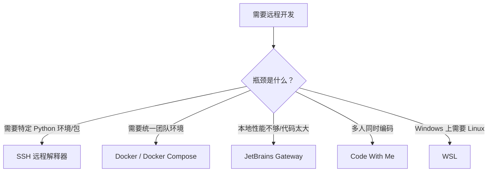

## 1. 概述

PyCharm 是 JetBrains 出品的 Python IDE，提供了多种远程开发方式，适用于不同的场景。远程开发的核心价值在于：

- **代码在远程**：源码存储在服务器/容器中，本地不需要完整的环境
- **运行在远程**：Python 解释器、依赖包、GPU 等资源都在远端
- **编辑在本地**：享受本地 IDE 的流畅交互体验

PyCharm 支持以下几种远程开发方式，本文将逐一详解：

```
方式                              适用场景
─────────────────────────────────────────────────────
① SSH 远程解释器              │  有远程服务器，想用服务器的 Python 环境
② Docker / Docker Compose     │  使用容器化的开发环境
③ WSL 解释器                 │  Windows 上使用 WSL 中的 Python
④ JetBrains Gateway           │  服务器端运行 IDE 后端，本地用瘦客户端
⑤ Code With Me               │  多人协作，共享 IDE 会话
⑥ Vagrant                    │  使用 Vagrant 管理的虚拟机
⑦ 手动部署（Deployment）      │  本地编辑 + 自动上传到远程服务器
```

> **版本要求**：方式①②⑥需要 PyCharm Professional 版。Community 版不支持远程解释器。

---

## 2. 方式一：SSH 远程解释器（最常用）

### 2.1 工作原理

```
┌──────────────────────┐         SSH 连接        ┌──────────────────────┐
│    本地 PyCharm       │ ◄─────────────────────► │     远程 Linux 服务器  │
│                      │                          │                      │
│  • UI 渲染（本地）     │                          │  • Python 解释器       │
│  • 代码编辑           │                          │  • 项目文件            │
│  • 智能补全请求        │                          │  • 依赖包 (pip/conda)  │
│                      │                          │  • 数据库/GPU 等资源    │
│  ┌────────────────┐  │                          │                      │
│  │ SFTP 文件同步   │──┼─────────────────────────►│  • 实际执行代码         │
│  └────────────────┘  │                          │                      │
└──────────────────────┘                          └──────────────────────┘
```

关键点：
- 代码在本地编辑，通过 SFTP 自动同步到远程服务器的临时目录
- Python 脚本实际在远程服务器上运行，输出回传到本地显示
- 代码补全、跳转定义等智能功能通过 SSH 调用远程解释器完成

### 2.2 配置步骤

**前提条件**：
- 远程服务器开启了 SSH 服务（端口通常是 22）
- 本地可以通过 SSH 密钥或密码登录服务器
- PyCharm Professional 版本

**Step 1：配置 SSH 连接**

```
Settings → Tools → SSH Configurations → 点击 "+"
```

填写以下信息：

| 字段 | 说明 | 示例 |
|------|------|------|
| Host | 服务器 IP 或域名 | `192.168.1.100` 或 `myserver.example.com` |
| Port | SSH 端口 | `22`（默认） |
| Username | 登录用户名 | `root` 或 `ubuntu` |
| Authentication type | 认证方式 | `Key pair`（推荐）或 `Password` |
| Private key file | 私钥路径 | `~/.ssh/id_rsa` |

> **推荐使用密钥认证**，避免每次连接都输入密码。可以用 `ssh-keygen` 生成密钥对，用 `ssh-copy-id user@host` 将公钥上传到服务器。

**Step 2：配置远程解释器**

```
Settings → Project → Python Interpreter → 齿轮图标 → Add → SSH Interpreter
```

1. 选择已有的 SSH 配置（或新建）
2. 指定远程解释器路径，例如：
   - 系统 Python：`/usr/bin/python3`
   - Conda 环境：`/home/user/miniconda3/envs/myenv/bin/python`
   - Virtualenv：`/home/user/venv/bin/python`
3. 设置本地项目与远程路径的**映射（Mappings）**：
   - Local path：`/Users/me/myproject`
   - Remote path：`/home/user/pycharm_projects/myproject`

> **映射路径说明**：PyCharm 会将本地代码通过 SFTP 自动上传到 Remote Path，远程执行时也在这个目录下查找文件。

**Step 3：上传并同步**

配置完成后，PyCharm 会自动将项目文件上传到远程服务器。之后每次保存文件都会自动同步。

可以在 `Tools → Deployment → Options` 中设置同步策略：
- `Always`：保存时始终自动上传
- `On explicit save`：仅手动保存时上传（Ctrl+S）
- `Never`：手动触发上传

### 2.3 使用体验

| 功能 | 本地 | SSH 远程 |
|------|------|----------|
| 代码编辑 | 流畅（本地） | 流畅（本地） |
| 代码补全 | 即时（本地 index） | 稍有延迟（通过网络查询远程解释器） |
| 运行/调试 | 本地执行 | **远程服务器执行**，输出回传本地 |
| Terminal | 本地终端 | 可打开远程 SSH 终端 |
| 依赖安装 | 本地 pip | 需要在远程执行 `pip install` |

### 2.4 常见问题

**Q：代码补全很慢？**
A：因为 LSP / 代码智能需要查询远程解释器，网络延迟有影响。可以：
- 使用局域网内的服务器
- 在远程服务器上开启 SSH 连接复用（`ControlMaster`）
- 配置 `.ssh/config` 保持长连接：

```
Host myserver
    HostName 192.168.1.100
    User ubuntu
    IdentityFile ~/.ssh/id_rsa
    ServerAliveInterval 60
    ServerAliveCountMax 10
    ControlMaster auto
    ControlPath ~/.ssh/sockets/%r@%h:%p
    ControlPersist 10m
```

**Q：如何安装远程包？**
A：在 PyCharm 的 Terminal 中打开远程终端（`Tools → Start SSH Session`），然后直接 `pip install`。或者用 Settings → Python Interpreter 的包管理界面。

**Q：远程路径上出现权限问题？**
A：确保 SSH 用户对 `/home/user/pycharm_projects/` 有读写权限。可以用 `chmod` 调整。

---

## 3. 方式二：Docker / Docker Compose 解释器

### 3.1 工作原理

Python 解释器运行在 Docker 容器中，而不是宿主机上。

```
┌──────────────┐                    ┌──────────────────────────┐
│  PyCharm     │  Docker API / CLI  │  Docker 容器              │
│  (本地)      │ ◄────────────────► │  ├── Python 解释器         │
│              │                    │  ├── 项目文件（Volume 挂载）│
│              │                    │  └── 依赖包               │
└──────────────┘                    └──────────────────────────┘
```

### 3.2 配置步骤

**前提**：本地已安装 Docker / Docker Desktop。

**方式 A：单个 Docker 容器**

```
Settings → Project → Python Interpreter → Add → Docker
```

1. 选择 Docker server（本地 Docker 或远程 Docker daemon）
2. 选择 Image（如 `python:3.12`）或 Dockerfile
3. 设置容器内的 Python 解释器路径（如 `/usr/local/bin/python`）
4. 配置 Volume 映射：本地项目路径 → 容器内路径

**方式 B：Docker Compose**

```
Settings → Project → Python Interpreter → Add → Docker Compose
```

1. 选择 `docker-compose.yml` 文件
2. 选择 service（如 `web`、`app`）
3. 环境变量可以从 `.env` 文件或 Compose 配置中读取

```yaml
# 示例 docker-compose.yml
version: '3.8'
services:
  app:
    image: python:3.12
    volumes:
      - .:/app
    working_dir: /app
    environment:
      - PYTHONUNBUFFERED=1
    command: tail -f /dev/null  # 保持容器运行
```

### 3.3 适用场景

- 团队统一开发环境，避免「在我机器上能跑」的问题
- 需要特定系统依赖（如 C 库、系统工具）
- CI/CD 中使用相同 Docker 镜像，保证环境一致
- 微服务项目中使用 Docker Compose 编排多服务

---

## 4. 方式三：WSL 解释器（仅 Windows）

### 4.1 工作原理

Windows Subsystem for Linux (WSL) 允许在 Windows 中运行完整的 Linux 内核。PyCharm 可以直接使用 WSL 中的 Python 解释器。

```
┌─────────────────────────────────────┐
│         Windows 宿主机               │
│  ┌──────────┐    ┌───────────────┐  │
│  │ PyCharm  │───►│ WSL 2 虚拟机   │  │
│  │ (Windows)│    │ ├─ Python 3.12 │  │
│  │          │    │ ├─ pip 包      │  │
│  │          │    │ └─ 项目文件     │  │
│  └──────────┘    └───────────────┘  │
└─────────────────────────────────────┘
```

### 4.2 配置步骤

1. 在 Windows 上安装 WSL 2：`wsl --install`
2. 在 WSL 中安装 Python：`sudo apt install python3`
3. PyCharm 中：`Settings → Python Interpreter → Add → WSL`
4. 选择 WSL 发行版和 Python 路径

### 4.3 优劣

| 优点 | 缺点 |
|------|------|
| 享受 Linux 开发体验，同时用 Windows 桌面 | 仅限 Windows |
| 文件系统性能好（WSL 2 的 9p 文件系统） | WSL 和 Windows 文件系统跨访问有性能损耗 |
| 不需要额外的虚拟机管理 | 部分网络功能（如 VPN）可能冲突 |

---

## 5. 方式四：JetBrains Gateway（远程开发）

### 5.1 核心概念

这是 JetBrains 最新的远程开发方案，与「SSH 远程解释器」有本质区别：

| 对比维度 | SSH 远程解释器 | JetBrains Gateway |
|----------|---------------|-------------------|
| IDE 前端（UI） | 本地运行 | 本地运行（JetBrains Client） |
| IDE 后端（代码分析） | 本地运行 | **远程服务器上运行** |
| 代码存储 | 本地上传副本到远程 | 主要存储在远程 |
| 智能补全延迟 | 依赖网络 | 极低（分析在远程本地完成） |
| 资源消耗 | 本地需要较强性能 | 本地瘦客户端，远程需要资源 |

### 5.2 架构

```
┌───────────────────┐                    ┌──────────────────────────┐
│  本地机器（瘦客户端）│                    │     远程服务器             │
│                   │   SSH / HTTPS      │                          │
│  JetBrains Client  │ ◄────────────────► │  IDE Backend (Headless)  │
│  • 编辑器 UI       │                    │  • 代码索引 & 分析         │
│  • 键盘输入        │                    │  • 语言服务器 (LSP)        │
│  • 渲染           │                    │  • 构建、运行、调试         │
│                   │                    │  • Git 操作               │
│                   │                    │  • 所有文件 I/O            │
└───────────────────┘                    └──────────────────────────┘
```

### 5.3 配置步骤

1. 在本地安装 **JetBrains Gateway**（独立应用，不依赖 PyCharm）
2. 选择连接方式：
   - **SSH**：直接连接到已有 SSH 服务器，Gateway 会自动下载并启动 IDE Backend
   - **JetBrains Space**：连接到 Space 云开发环境
   - **GitHub Codespaces**：使用 GitHub 的云端开发环境
3. 选择项目路径并启动

> Gateway 会自动在远程服务器上安装 Thin Client 版本的 PyCharm（或其他 JetBrains IDE）。首次启动需要下载（约 500MB-1GB），之后会缓存。

### 5.4 适用场景

- 远程服务器性能远强于本地（如带 GPU 的深度学习工作站）
- 代码库巨大（百万行级），本地索引太慢
- 需要在固定远程环境中开发，多台设备随时接入
- 安全要求高的场景（代码不离开服务器）

### 5.5 实际案例

```bash
# 在远程 GPU 服务器上开发深度学习项目
# 本地只是一台普通笔记本，通过 Gateway 连接到 8×A100 的服务器
# 所有代码、模型、数据都在服务器上
# IDE 的代码分析、索引、运行全部在服务器端完成
# 本地只负责显示 UI，网络只传输 UI 渲染指令
```

---

## 6. 方式五：Code With Me（协作开发）

### 6.1 工作原理

Code With Me 不是传统意义的「远程开发」，而是**远程协作**：一个人打开项目，其他人通过链接加入，实时共享编辑和调试。

```
┌──────────────┐                    ┌──────────────┐
│   Host        │     JetBrains     │   Guest       │
│  (项目所有者)  │     Relay Server  │  (协作者)      │
│              │ ◄────────────────► │              │
│  本地/远程项目 │                    │  看到 Host    │
│  正常运行     │                    │  的 IDE 视图   │
└──────────────┘                    └──────────────┘
```

### 6.2 使用方式

1. 在 PyCharm 中点击右上角的 Code With Me 图标
2. 选择「Enable Access and Copy Invitation Link」
3. 将链接发送给协作者
4. 协作者通过链接加入，可以：
   - 实时查看你的代码
   - 跟随你的光标
   - 独立编辑（权限需要 Host 分配）
   - 共同调试

### 6.3 适用场景

- 结对编程（Pair Programming）
- 代码审查（实时讲解）
- 远程面试
- 协助同事解决 bug

---

## 7. 方式六：Vagrant

### 7.1 工作原理

Vagrant 是一个虚拟机管理工具。PyCharm 可以使用 Vagrant 虚拟机中的 Python 解释器。

```
┌──────────────┐                    ┌──────────────────┐
│  PyCharm     │  vagrant ssh       │  Vagrant VM       │
│  (宿主机)    │ ◄────────────────► │  (VirtualBox等)    │
│              │                    │  ├── Python       │
│              │                    │  └── 项目文件       │
└──────────────┘                    └──────────────────┘
```

### 7.2 配置

```bash
# 初始化 Vagrant
vagrant init ubuntu/jammy64
vagrant up
```

在 PyCharm 中：`Settings → Python Interpreter → Add → Vagrant`，选择 Vagrant 实例文件夹和 Python 路径。

> 当前 Vagrant 使用率下降，Docker 和 Gateway 是更主流的选择。

---

## 8. 方式七：手动部署（Deployment）

### 8.1 适用场景

与 SSH 远程解释器不同，手动部署模式下本地和远程使用不同的解释器。适合：
- 本地开发和测试，定期上传到远程服务器运行
- 不需要远程解释器的代码智能功能
- 通过 SFTP/FTP/FTPS 上传

### 8.2 配置

```
Tools → Deployment → Configuration → 点击 "+" → SFTP
```

配置远程服务器信息后，可以：
- 右键文件/文件夹 → Deployment → Upload to...
- 设置自动上传（保存时触发）
- 对比本地和远程文件差异
- 直接在远程服务器上浏览文件

---

## 9. 方式对比总结

| 方式 | 代码位置 | Python 运行位置 | IDE 后端 | 需要版本 | 适合场景 |
|------|---------|----------------|---------|---------|---------|
| SSH 远程解释器 | 本地+远程同步 | 远程 | 本地 | Professional | 有远程服务器，想用远程环境 |
| Docker | 本地 (Volume) | 容器 | 本地 | Professional | 容器化开发，环境一致 |
| Docker Compose | 本地 (Volume) | 容器 | 本地 | Professional | 多容器微服务项目 |
| WSL | 本地/WSL | WSL | 本地 | Professional | Windows 上用 Linux 环境 |
| JetBrains Gateway | 远程 | 远程 | 远程 | 独立应用 | 远程高性能服务器，大项目 |
| Code With Me | 共享 | Host 环境 | Host 本地 | 任意 | 结对编程、代码审查 |
| Vagrant | 本地+VM | VM | 本地 | Professional | 传统 VM 管理 |
| 手动部署 | 本地 | 各自独立 | 本地 | 任意 | 仅需上传，不需远程运行 |

---

## 10. 选型建议

选择远程开发方式的核心问题是：**你的瓶颈在哪？**



**推荐路径**：
1. 新手起步 → SSH 远程解释器（最常用、最简单）
2. 团队协作 → Docker Compose + SSH 远程解释器
3. 高性能需求 → JetBrains Gateway
4. 结对编程 → Code With Me

---

## 11. 常见问题排查

### 11.1 SSH 连接失败

```bash
# 先在终端中测试 SSH 连接
ssh -v user@host

# 常见原因：
# - 防火墙阻止了 22 端口
# - SSH 服务未启动：systemctl status sshd
# - 密钥权限问题：chmod 600 ~/.ssh/id_rsa
```

### 11.2 远程解释器找不到包

```bash
# 确认远程环境中包是否已安装
ssh user@host "python3 -c 'import numpy; print(numpy.__version__)'"

# 如果远程解释器使用了虚拟环境，确保路径正确
ssh user@host "which python3"
```

### 11.3 PyCharm 远程卡顿

- 检查 `Tools → Deployment → Options`，关闭不必要的自动上传
- 使用 SSH 连接复用（见 2.4 节）
- 如果项目很大，考虑使用 JetBrains Gateway
- 排除大文件/目录：`Tools → Deployment → Configuration → Excluded Paths`

### 11.4 Gateway 连接后 IDE Backend 启动失败

- 检查远程服务器磁盘空间：`df -h`（IDE Backend 需要至少 2GB）
- 检查远程服务器内存：`free -h`（建议至少 4GB）
- 查看远程日志：`~/.cache/JetBrains/RemoteDev/logs/`

---

> **延伸阅读**：
> - JetBrains 官方文档：https://www.jetbrains.com/help/pycharm/remote-development.html
> - JetBrains Gateway 文档：https://www.jetbrains.com/remote-development/gateway/
> - SSH 连接复用参考：`man ssh_config` 中的 ControlMaster 章节
