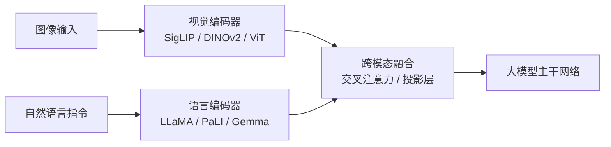

# VLA（Vision-Language-Action）视觉-语言-动作模型

## 一句话定义

> **VLA 是让机器人"看懂、听懂、做到"的端到端模型**——将视觉感知、自然语言理解和动作控制统一在同一框架，实现从感知直接到执行的一体化闭环。

在更早的多模态栈中，功能的边界划分曾是：

```
LLM:   文本 → 文本           (ChatGPT, Claude)
VLM:   图像 + 文本 → 文本    (GPT-4V, LLaVA)
VLA:   图像 + 文本 → 机器人动作 (RT-2, OpenVLA, π0)
```

VLA 的本质是在 VLM 的基础上加了一个"动作头"，将大模型的常识推理能力延伸到物理世界。

---

## 一、核心价值：打破模态边界

传统机器人系统是**感知→规划→控制**三条独立流水线，靠人工接口串接：

```
相机 → 视觉检测 → 符号化场景 → 手工规则规划 → 轨迹生成 → 关节控制
```

问题在于：每个环节的信息损失层层累积，系统僵化，换个场景就得重新写规则。

VLA 把这三步**熔成一个端到端网络**：

```
[图像] + [自然语言指令] → Transformer → [动作序列]
```

核心价值：

| 传统方案 | VLA |
|---------|-----|
| 感知-规划-控制割裂，人工串接 | 端到端统一模型 |
| 依赖手工规则和任务特定编程 | 语言指令即可驱动 |
| 场景切换需重新开发 | 泛化到未见过的物体和指令 |
| 无常识推理 | 利用 VLM 预训练带来的常识知识 |

---

## 二、技术架构

VLA 模型的技术架构可分解为四个核心模块：

### 2.1 多模态编码器



- **视觉编码器**：ViT / SigLIP（语义理解）+ DINOv2（空间理解），双编码器融合为当前最佳实践
- **语言编码器**：LLaMA-2、PaLI、Gemma 等大模型解析指令语义
- **跨模态融合**：通过交叉注意力机制，语言作为 Query 引导视觉特征的加权组合（如根据"拿起红色杯子"自动关注图像中的红色杯子区域）

### 2.2 动作生成模块

两种主流方案：

| 方案 | 原理 | 代表模型 | 特点 |
|------|------|---------|------|
| **离散 Token 化** | 将动作（位移、旋转等）编码为离散整数 Token，像生成文本一样输出动作 | RT-2, OpenVLA | 简单复用 LLM 能力，速度偏慢 |
| **连续轨迹预测** | 使用扩散模型或流匹配，直接在连续空间生成平滑动作轨迹 | Octo, π0, RDT-1B | 动作平滑，适合灵巧操作 |

> **FAST Tokenizer**（π0-FAST）：结合离散余弦变换（DCT）和字节对编码（BPE），将动作序列压缩率提升 10 倍，训练速度加快 5 倍，支持高达 480Hz 的动作频率。

### 2.3 闭环控制与优化

- **强化学习（RL）**：RLHF 人类反馈解决长周期稀疏奖励问题；在线微调框架（如 iRe-VLA）在 RL 和 SFT 之间迭代
- **世界模型辅助**：DECKARD 利用 LLM 生成抽象世界模型，支持基于模型的规划
- **动态仿真**：UniSim / NVIDIA Isaac Sim 生成多样化训练数据

### 2.4 轻量化与实时性

- **LoRA 微调**：OpenVLA 仅微调 0.17% 参数即可适配新任务
- **MoE 架构**：稀疏激活仅部分专家网络，减少计算量
- **双系统架构**：Helix 的 S2（70 亿参数，7-9Hz 高层规划）+ S1（8000 万参数，200Hz 实时控制）异步并行

---

## 三、关键模型演进（2023–2025）

### 演进时间线

```
2023.07  RT-2 (Google DeepMind)
        55B参数，闭源，首次证明VLA可行
        涌现推理能力：语义推理从0%→48%
        ❌ 闭源、太重、太慢（~3Hz）
              ↓
2024.05  Octo (UC Berkeley)
        93M参数，开源，22机器人跨具身
        扩散动作头实现多模态动作
        ❌ 缺乏VLM常识知识
              ↓
2024.06  OpenVLA (Stanford)
        7B参数，开源，7B击败55B RT-2-X
        双视觉编码器（SigLIP+DINOv2）
        LoRA消费级GPU可微调
        ❌ 仍为离散输出（~6Hz）
              ↓
2024.10  π0 (Physical Intelligence)
        ~3B参数，流匹配替代扩散，50Hz控制
        10,000小时机器人训练数据
        灵巧操作突破
        ❌ 模型权重未完全开源
              ↓
2025.04  π0.5 (Physical Intelligence)
        开放世界泛化，清理厨房和卧室
              ↓
2025+    Gemini Robotics, MindVLA, GOVLA...
        端侧部署、量产落地、全身控制
```

### 详细模型对比

| 维度 | RT-2 | Octo | OpenVLA | π0 |
|------|------|------|------|------|
| **年份** | 2023.07 | 2024.05 | 2024.06 | 2024.10 |
| **机构** | Google DeepMind | UC Berkeley | Stanford | Physical Intelligence |
| **参数规模** | 55B | 27M / 93M | 7B | ~3B+ |
| **开源** | 闭源 | 完全开源 | 完全开源 | 部分开源 |
| **动作输出** | 离散 Token | 扩散（连续） | 离散 Token | 流匹配（连续） |
| **推理速度** | ~3 Hz | ~10 Hz | ~6 Hz | **~14 Hz**（50动作chunk） |
| **动作频率** | 3 Hz | 10 Hz | 6 Hz | **50 Hz** |
| **跨具身** | 1 个机器人 | 22 个机器人 | 多机器人 | 多机器人 |
| **微调成本** | 不可用 | 1×RTX 3090 | 1×RTX 3090 (LoRA) | 大 GPU 集群 |
| **语义推理** | **强**（55B VLM） | 弱 | 良好（7B VLM） | 良好（3B VLM） |
| **灵巧操作** | 有限 | 有限 | 有限 | **强** |

### 各模型的核心创新

**RT-2：概念验证**
- 首次将机器人动作离散化为 256 个 bin 的文本 Token（`"1 128 91 241"`）
- 直接复用 PaLI-X 55B VLM，无需修改架构
- **关键证明**：网络规模预训练的常识知识可以迁移到机器人动作。语义推理能力从 RT-1 的 0% 跃升至 48%

**Octo：打破闭源壁垒**
- 首个开源通用策略，仅 93M 参数
- 扩散动作头实现多模态动作（从学习到的分布中采样，而非仅预测均值）
- 跨 22 个机器人平台训练（Open X-Embodiment 数据集）

**OpenVLA：7B 击败 55B**
- **双视觉编码器**：SigLIP（语义理解）+ DINOv2（空间理解），分别回答"这是什么"和"它在哪"
- 证明 **VLM 主干质量 + 良好的机器人微调 > 原始参数量**
- LoRA 仅微调 0.17% 参数（13.1M / 7.6B），消费级 RTX 3090 可跑

**π0：灵巧操作突破**
- 流匹配（Flow Matching）替代扩散：学习从噪声到数据的**直线路径**，2-5 倍更快
- VLM 专家（语义理解）+ 动作专家（流匹配去噪），交叉注意力连接
- 50 动作 chunk @ 50Hz，推理仅需 73ms
- 支持折叠衣物、倒水、擦拭等精细操作

---

## 四、VLA vs 世界模型：两大路线的对比与融合

这是 2025–2026 具身智能领域最核心的路线之争。

### 4.1 本质差异

| 维度 | VLA | 世界模型 + 动作策略（WMA） |
|------|-----|--------------------------|
| **核心思想** | 从感知到动作的直接映射 | 先理解世界如何演变，再决定动作 |
| **优化目标** | 任务成功率 | 世界状态预测 + 任务成功率 |
| **物理常识** | 从动作数据中**隐式**学习 | 通过视频/状态预测**显式**学习 |
| **优势** | 推理效率高、指令跟随灵活、数据充足时效果好 | 泛化能力强、长程规划可靠、安全性更高 |
| **劣势** | 新环境泛化差、缺乏物理理解、长程任务不可靠 | 计算开销大、视频生成增加延迟 |
| **代表** | π0, OpenVLA, RT-2 | DreamZero, DECKARD, UniSim |

### 4.2 类比理解

- **VLA 路线**：像人靠大量练习形成"肌肉记忆"，看一眼→本能反应。适合短平快的操作（抓取、拧螺丝）
- **世界模型路线**：像人先在脑子里推演"如果我这样推，物体会怎么运动"，再出手。适合长程规划（整理房间、物流调度）

> 英伟达机器人主管 Jim Fan 2025 年初判断：2025 年具身智能由 VLA 主导，2026 年将是世界模型首次成为机器人领域典型基础的一年。

### 4.3 融合趋势：不是替代，而是协同

当前学术界和产业界的共识：**两条路线不是二选一，而是可以融合**。

| 融合方向 | 思路 | 代表工作 |
|---------|------|---------|
| **世界模型增强 VLA** | 在 VLA 中引入轻量世界模型做动作验证 | DreamVLA, GigaBrain-0 |
| **VLA 辅以世界先验** | 世界模型为 VLA 提供物理常识，辅助长程规划 | VLWM |
| **双系统架构** | 快系统（VLA）处理实时反应，慢系统（世界模型）处理规划 | Helix 的 S1+S2 设计 |

> 智元机器人 2026 年观点："世界模型与 VLA 不是替代关系，而是可以融合、合作的技术路径。单纯依靠视觉和语言指令完成机器人任务的时代已经过去。"

---

## 五、训练范式

### 5.1 预训练 + 微调（当前主流）

```
阶段1：预训练
  - 在大规模互联网数据上训练 VLM（图文对、视频）
  - 获得常识推理、物体识别、空间理解能力

阶段2：机器人数据微调
  - 用机器人轨迹数据微调动作生成模块
  - 数据来源：Open X-Embodiment（百万级轨迹）、各实验室采集
  - 方法：全参数微调（RT-2）或 LoRA（OpenVLA）
```

### 5.2 强化学习

- **行为克隆（BC）**：直接模仿专家轨迹，适合快速上手简单任务
- **PPO + VLA**：用 RL 优化策略，处理稀疏奖励的复杂任务
- **RLHF**：引入人类偏好反馈，解决长周期任务

### 5.3 核心数据集

| 数据集 | 规模 | 特点 |
|--------|------|------|
| **Open X-Embodiment** | 百万级轨迹，100+ 任务类型 | 跨具身最大开源数据集 |
| **VLABench** | 100 任务类别，2000+ 对象 | VLA 通用评测基准 |
| **Ego4D / EPIC-KITCHENS** | 第一人称视频 | 用于视觉-语言表征预训练 |
| **π0 训练数据** | 10,000+ 小时 | 跨多种机器人形态（未开源） |

---

## 六、应用场景

### 6.1 工业自动化
- **特斯拉 Optimus**：VLA 理解"组装零件"指令，结合视觉和力控完成高精度操作
- **Google Gemini Robotics**：双臂机器人在本地运行 VLA，仅需 50 次演示即可适应皮带组装等新技能

### 6.2 家庭服务
- **π0 / π0.5**：折衣服、倒水、擦桌子、清理厨房和卧室，开放世界泛化
- **Apollo 机器人**：理解"从冰箱取饮料"，结合 3D 场景重建和路径规划

### 6.3 自动驾驶
- **理想 MindVLA**：整合空间智能与语言推理，处理潮汐车道等长时序推理场景，计划 2026 量产
- **Waymo EMMA**：将摄像头与导航指令直接映射为驾驶轨迹

### 6.4 多机器人协作
- **Figure AI Helix**：两机器人通过自然语言协同完成"传递饼干"任务，成功率达 89.7%
- **Psi R1**：基于 CoAT（Chain of Action Thought）框架，持续任务时长超 30 分钟

---

## 七、核心挑战与开放问题

| 挑战 | 现状 | 关键瓶颈 |
|------|------|---------|
| **实时性** | 当前 3-50Hz，理想需 100-1000Hz | 模型规模 vs 推理速度的矛盾 |
| **泛化能力** | 新物体、新环境泛化仍弱 | 依赖训练数据分布，缺乏物理常识 |
| **长程任务** | 多步骤任务失败率指数增长 | 误差累积、无可靠规划 |
| **数据稀缺** | 机器人数据远比互联网数据稀缺 | 采集成本高、缺乏统一标准 |
| **物理理解** | 隐式编码，非显式建模 | 无法进行反事实推理 |
| **评估标准** | 各评测基准互不兼容 | 缺乏行业共识的 benchmark |
| **端侧部署** | 7B+ 模型难以部署到嵌入式设备 | 蒸馏/量化带来性能损失 |

---

## 八、与"世界模型"笔记的交叉阅读

- 本笔记中的"决策规划派"（DreamerV3）与 VLA 中的"世界模型增强"思路互补
- 本笔记中的"空间智能派"（World Labs Marble）关注 3D 场景生成，VLA 关注动作控制，二者可结合
- 杨立昆的 JEPA 路线反对"生成像素"，VLA 主流路线也不生成像素（直接输出动作），但 VLA 依赖 VLM 预训练，与 JEPA 的理念有交集也有分歧

详见：[[世界模型]]

---

## 九、关键文献

| 文献 | 年份 | 意义 |
|------|------|------|
| Brohan et al., **RT-2** | 2023.07 | 首个大规模 VLA，证明 VLM→动作的可行性 |
| Octo Model Team, **Octo** | 2024.05 | 首个开源、跨具身通用策略，扩散动作头 |
| Kim et al., **OpenVLA** | 2024.06 | 7B 开源 VLA 击败 55B RT-2-X，双视觉编码器 |
| Black et al., **π0** | 2024.10 | 流匹配实现 50Hz 灵巧操作 |
| Pertsch et al., **FAST** / **π0-FAST** | 2025.01 | 高效动作 Token 化，支持 480Hz |
| Chen et al., **RDT-1B** | 2024 | 扩散模型生成人形机器人 20+ 关节连续动作 |
| Zitkovich et al., **RT-1** | 2022 | 首个基于 Transformer 的 VLA 模型 |
| Yuan et al., **VLA综述** (IEEE) | 2025 | 来自东京大学/牛津/UT Austin 的全面综述 |
| **VLABench** | 2025 | VLA 通用评测基准，100 任务类别 |

---

## 十、总结

> VLA 正处于从"研究突破"向"工程落地"的关键转折期。2024 年 OpenVLA 和 π0 实现了技术验证，2025 年 Gemini Robotics 和 MindVLA 在推进量产落地。但与世界模型的融合、实时性、泛化能力、长程规划仍是核心瓶颈——VLA 在"看懂指令+立刻执行"上已经很强，但在"理解这个世界的物理规律"上仍有很长的路要走。
