> 深入理解 Linux Namespace 机制，以及 nsjail 如何基于它构建仅次于虚拟机级别的进程隔离沙箱。

## 1. 为什么需要 Namespace？

在 Linux 中，所有进程默认共享同一套"全局资源视图"：同一个进程 ID 空间、同一棵文件系统树、同一张网络接口表。这意味着一个进程可以：

- `kill` 掉别人的进程（共享 PID 空间）
- `umount` 掉别人的挂载点（共享 Mount 树）
- 看到所有网络接口和连接（共享 Network 栈）

**Namespace（命名空间）** 就是用来打破这种共享的。它把全局资源"切分"成独立的虚拟副本，每个 Namespace 内的进程只能看到属于自己的那份——就像住进了不同的"平行宇宙"。

一句话概括：

> Namespace 是 Linux 内核提供的**资源视图隔离机制**——不是虚拟化硬件，而是限制"你能看到什么"。

## 2. 七种 Namespace 逐一拆解

Linux 目前支持 7 种 Namespace，每种隔离一类系统资源：

### 2.1 Mount Namespace（挂载命名空间）

| 项目 | 说明 |
|------|------|
| **隔离资源** | 文件系统挂载点（mount points） |
| **内核标志** | `CLONE_NEWNS` |
| **创建命令** | `unshare --mount` |

**隔离效果**：每个 Mount Namespace 有自己的挂载点列表。在一个 NS 里 `/proc` 可能挂载的是受限视图，另一个 NS 里可能是完整视图。

**nsjail 中的关键应用**：
- 将 `proc` 重新挂载为受限版本（`mount -t proc none /proc`）
- 绑定挂载（bind mount）只把 `/usr`、`/bin`、`/lib*` 等最小依赖以只读方式映射进去
- **彻底隐藏宿主机文件系统**，即使进程拿到了 root 也看不到不该看的目录

```bash
# nsjail 的本质操作之一：在 jail 内重新构建文件系统视图
mount --bind /real/bin   /jail/bin
mount --bind /real/usr   /jail/usr
mount --bind /workspace  /jail/workspace
mount -t proc none       /jail/proc     # 受限 proc
```

### 2.2 PID Namespace（进程 ID 命名空间）

| 项目 | 说明 |
|------|------|
| **隔离资源** | 进程 ID 编号空间 |
| **内核标志** | `CLONE_NEWPID` |
| **创建命令** | `unshare --pid` |

**隔离效果**：每个 PID Namespace 重新对进程编号。在 namespace 内看到的 PID 1，在外面可能是 PID 28471。进程只看得见同 namespace 的进程。

**nsjail 中的关键应用**：
- Jail 内的恶意进程 `kill -9 1` 只能杀掉自己 namespace 的 init 进程，碰不到宿主机的 systemd
- Jail 内的进程无法"意外发现"外部进程的 PID
- `ps aux` 在 jail 内只能列出有限进程

```
宿主机 PID 空间：           nsjail PID 空间：
  PID 1   → systemd           PID 1   → jail init
  PID 28471 → nsjail实例       PID 2   → /bin/sh
  PID 28472 → /bin/sh          PID 3   → python foo.py
  PID 28473 → python foo.py
```

### 2.3 Network Namespace（网络命名空间）

| 项目 | 说明 |
|------|------|
| **隔离资源** | 网络设备、IP 地址、路由表、iptables/nftables 规则、端口号空间 |
| **内核标志** | `CLONE_NEWNET` |
| **创建命令** | `unshare --net` |

**隔离效果**：每个 Network Namespace 拥有完全独立的网络栈——自己的网卡列表、自己的路由表、自己的防火墙规则、自己的端口空间。

```
宿主机 netns：               nsjail netns（clone_newnet: true）：
  eth0: 192.168.1.10         lo: 127.0.0.1（仅此一个接口）
  wlan0: 10.0.0.5
  路由表：default via 192.168.1.1
  端口：nginx 监听 :80
                            路由表：空（无默认路由）
                            端口：全部空闲
                            → 完全无法访问外部网络
```

#### veth pair：沟通两个 network namespace 的虚拟网线

默认情况下，新 netns 只有一个 `lo`，与外部完全隔绝。要让流量进出，需要 **veth pair**——一对虚拟以太网设备，像一根网线的两端，分别插在两个 namespace 里：

```
宿主机 netns                   沙箱 netns
┌─────────────────┐           ┌─────────────────┐
│                 │           │                 │
│  veth0_h ──────────────────── veth0_j         │
│  (10.200.0.1)   │  veth pair │ (10.200.0.2)   │
│                 │           │                 │
│  路由表：        │           │  路由表：        │
│  default via    │           │  default via    │
│  192.168.1.1    │           │  10.200.0.1     │
└─────────────────┘           └─────────────────┘
```

创建过程：

```bash
# 1. 创建 veth pair（成对出现，像一根网线的两端）
ip link add veth0_h type veth peer name veth0_j

# 2. 把其中一端移入沙箱 netns
ip link set veth0_j netns sandbox-net

# 3. 分别配置两端的 IP + 启用
ip addr add 10.200.0.1/30 dev veth0_h    # host 侧
ip link set veth0_h up

ip netns exec sandbox-net \
  ip addr add 10.200.0.2/30 dev veth0_j  # sandbox 侧
ip netns exec sandbox-net \
  ip link set veth0_j up

# 4. 沙箱内添加默认路由，指向 host 侧 IP
ip netns exec sandbox-net \
  ip route add default via 10.200.0.1

# 5. host 侧开启 IP 转发 + NAT，让沙箱流量能出外网
sysctl -w net.ipv4.ip_forward=1
iptables -t nat -A POSTROUTING -s 10.200.0.0/30 -j MASQUERADE
```

数据流路径：
```
沙箱内进程 → socket() → 路由查表 → 下一跳 10.200.0.1
  → veth0_j → veth pair → veth0_h（到达宿主机 netns）
  → iptables MASQUERADE（源 IP 改写为宿主机 IP）
  → 宿主机路由 → eth0 → 外网
```

#### nsjail 中的配置

```ini
# clone_newnet: true  — 创建独立 netns，默认只有 lo，完全无网络
clone_newnet: true

# clone_newnet: false — 继承父进程 netns，有完整网络访问能力
clone_newnet: false
```

> **工程实践**：本项目中 nsjail 使用 `clone_newnet: false`（不隔离），网络隔离交由外部 `ip netns exec` + `setup_netns.sh` 在部署层统一管理。详见 [[内网沙箱网络隔离技术文档]]。

**为什么选择外部 netns 而非 nsjail 的 `clone_newnet`**：

| | nsjail clone_newnet: true | 外部 ip netns exec |
|---|---|---|
| **隔离粒度** | 全有或全无（有网 vs 无网） | 可精确到 IP/端口/域名白名单 |
| **防火墙** | 不支持（需自行在 jail 内配置） | nftables 白名单 default-drop |
| **DNS 控制** | 不支持 | dnsmasq 域名白名单 |
| **代理过滤** | 不支持 | HTTP CONNECT proxy 逐请求过滤 |
| **管理复杂度** | 无（全断最省事） | 需要 setup_netns.sh 初始化 |
| **适用场景** | 完全不需要网络的命令执行 | 需要**受控外网访问**的代码执行 |

---


### 2.4 User Namespace（用户命名空间）

| 项目 | 说明 |
|------|------|
| **隔离资源** | 用户 ID（UID）和组 ID（GID） |
| **内核标志** | `CLONE_NEWUSER` |
| **创建命令** | `unshare --user` |

**隔离效果**：这是安全性最关键的 namespace。它允许一个非 root 进程在 namespace **内部**被映射为 root（UID 0），但在 namespace **外部**它仍然是普通用户。这意味着即使进程"越狱"了，在外面也毫无特权。

```
宿主机 UID 空间：           nsjail UID 空间：
  root (UID 0)                nsjail-root (UID 0) → 实际映射到宿主 UID 1000
  jiaozipan (UID 1000)
```

**nsjail 中的关键应用**：
- 让 jail 内进程以为是 root，可以做 `mount`、`chroot` 等操作，但实际上没有真实特权
- 结合 seccomp-bpf 进一步限制"伪 root"可调用的 syscall — 详见 [[seccomp-bpf 技术详解：系统调用过滤原理与实践]]

#### User Namespace + seccomp-bpf 如何协同

> 问题：User NS 已经把 root 映射成了普通用户，为什么还要 seccomp？

User NS 只做了**权限映射**——让进程觉得自己是 root。但它不阻止进程去**尝试调用**只有 root 才有权执行的 syscall。进程仍然可以：

```bash
# jail 内进程觉得自己是 root
# whoami → root

# 尝试重启系统 — 会触发 reboot() syscall
reboot
# → 内核层面：检查调用者是否有 CAP_SYS_BOOT
# → User NS 内的"root"没有这个 capability
# → reboot 失败（但 syscall 本身已经被处理了！）
```

**syscall 被处理这件事本身就是风险**。内核在处理 `reboot()` 的过程中会走大量代码路径——其中任何一个存在漏洞，就可能被利用。User NS 阻止了操作**生效**，但没阻止**syscall 进入内核**。

**seccomp-bpf 补上的缺口**：在 User NS 外面加一层 syscall 防火墙，让危险的 syscall 连内核入口都进不去：

```
进程调用 reboot()
    │
    ▼
seccomp-bpf 检查 → syscall 编号 169 (reboot) 不在白名单 → KILL
    │
    ✗ 进程被终止，内核从未收到这个调用

对比只有 User NS 的情况：
进程调用 reboot()
    │
    ▼
内核接收 → 检查 capability → 拒绝 → 返回 EPERM
    │
    ⚠ 内核代码路径已被执行，潜在攻击面已暴露
```

**协同效果**：

| 防御层 | 作用 | 盲区 |
|--------|------|------|
| User NS | 阻止操作**生效**（权限检查失败） | 攻击面（kernel code path）已执行 |
| seccomp-bpf | 阻止操作**发起**（不进内核） | 不区分调用者身份 |
| **两者叠加** | 尝试不了危险调用 + 调用了也没权限 | — |

这就是纵深防御的核心思想：**User NS 管"你是谁"，seccomp 管"你能干什么"**。两者不是替代关系，是互补关系。

### 2.5 UTS Namespace（主机名/域名命名空间）

| 项目 | 说明 |
|------|------|
| **隔离资源** | 主机名（hostname）和 NIS 域名 |
| **内核标志** | `CLONE_NEWUTS` |
| **创建命令** | `unshare --uts` |

**隔离效果**：每个 UTS Namespace 有独立的 `hostname`。实用价值相对较小，但在容器编排和日志追踪中用于区分环境。

### 2.6 IPC Namespace（进程间通信命名空间）

| 项目 | 说明 |
|------|------|
| **隔离资源** | System V IPC 对象（共享内存、信号量、消息队列）和 POSIX 消息队列 |
| **内核标志** | `CLONE_NEWIPC` |
| **创建命令** | `unshare --ipc` |

**隔离效果**：防止不同 namespace 的进程通过 IPC 机制意外（或恶意）通信。一个 jail 内的进程无法通过 `shmget()` 读到另一个 jail 的共享内存。

### 2.7 Cgroup Namespace（控制组命名空间）

| 项目 | 说明 |
|------|------|
| **隔离资源** | cgroup 目录树的视图 |
| **内核标志** | `CLONE_NEWCGROUP` |
| **创建命令** | `unshare --cgroup` |

**隔离效果**：进程在 namespace 内看到的 cgroup 路径是"虚拟化"的。`/proc/self/cgroup` 的路径被重写为相对路径，防止信息泄露。

---

## 3. 七个 Namespace 的关系全景

```mermaid
graph TD
    subgraph "宿主机（全局视图）"
        P[全局 PID 空间<br>PID 1 = systemd]
        M[全局 Mount 树<br>/ 完整可见]
        N[全局 Network 栈<br>eth0, wlan0...]
        U[全局 User 空间<br>root, user1000...]
    end

    subgraph "nsjail Sandbox A"
        PA[PID NS<br>PID 1 = /bin/sh]
        MA[Mount NS<br>仅 /bin /usr /workspace]
        NA[Net NS<br>仅 lo + veth0]
        UA[User NS<br>内部 UID 0 = 外部 1000]
    end

    subgraph "nsjail Sandbox B"
        PB[PID NS<br>PID 1 = python]
        MB[Mount NS<br>仅 /bin /usr /workspace]
        NB[Net NS<br>仅 lo]
        UB[User NS<br>内部 UID 0 = 外部 1000]
    end

    P -.-> PA
    P -.-> PB
    M -.-> MA
    M -.-> MB
    N -.-> NA
    N -.-> NB
    U -.-> UA
    U -.-> UB

    style Sandbox_A fill:#1a1a2e,stroke:#e94560
    style Sandbox_B fill:#1a1a2e,stroke:#e94560
```



> **关键理解**：两个 nsjail 实例各自拥有独立的 7 套 namespace 副本，互不可见。Sandbox A 和 Sandbox B 之间完全无法通信或互相探测。

---

## 4. nsjail 如何组合这些 Namespace

nsjail 不是简单用了一次 `unshare`，而是**精确组合多种 namespace + 额外安全层**。下面是 nsjail 的隔离栈：

### 4.1 隔离栈全景

```
┌──────────────────────────────────────────────┐
│              用户代码（不可信）                  │
├──────────────────────────────────────────────┤
│  Landlock (LSM)  │ 进程内路径白名单（读/写/执行）   │
│                  │ 详见 [[Landlock 技术详解]]    │
├──────────────────────────────────────────────┤
│  seccomp-bpf     │ 规则引擎白名单：<300个syscall  │
├──────────────────────────────────────────────┤
│  rlimit / cgroup │ CPU/内存/进程数/文件大小限制    │
├──────────────────────────────────────────────┤
│  chroot + bind   │ 文件系统视图：仅挂必需目录       │
│  mount           │（/bin /lib /usr /workspace）  │
├──────────────────────────────────────────────┤
│  PID Namespace   │ 进程隔离：kill/ps 受限          │
│  Net Namespace   │ 网络隔离：默认无网络            │
│  User Namespace  │ 权限隔离：UID 映射欺骗          │
│  IPC Namespace   │ IPC 隔离：共享内存防泄漏        │
│  UTS Namespace   │ 主机名隔离                     │
│  Cgroup Namespace│ 资源视图隔离                   │
├──────────────────────────────────────────────┤
│           Linux Kernel                        │
└──────────────────────────────────────────────┘
```

### 4.2 nsjail 配置中如何启用

在 nsjail 的 `.cfg` 配置文件中，通过 `clone_newns` 等选项精确控制：

```ini
# nsjail.cfg - nsjail 的 namespace 配置

# Mount Namespace — 构建独立文件系统视图
clone_newns: true
mount {
  src: "/bin"
  dst: "/bin"
  is_bind: true
  rw: false           # 只读挂载，用户不可写
}
mount {
  src: "/usr"
  dst: "/usr"
  is_bind: true
  rw: false
}
mount {
  src: "/lib"
  dst: "/lib"
  is_bind: true
  rw: false
}
mount {
  src: "/lib64"
  dst: "/lib64"
  is_bind: true
  rw: false
}
mount {
  src: "/srv/sandboxes/alice"    # 用户工作区
  dst: "/workspace"
  is_bind: true
  rw: true            # 用户可写
}
mount {
  src: "none"
  dst: "/proc"
  fstype: "proc"      # 重新挂载受限 proc
}

# PID Namespace — 进程号独立
clone_newpid: true

# Net Namespace — 网络隔离
clone_newnet: true    # true = 无网络访问能力

# User Namespace — UID 映射
clone_newuser: true
uid_mapping {
  inside_id:  "0"     # jail 内 UID 0
  outside_id: "1000"  # 映射到宿主机普通用户
  count:      "1"
}

# IPC Namespace
clone_newipc: true

# UTS Namespace
clone_newuts: true

# Cgroup 资源限制
cgroup_mem_max: 268435456       # 256 MB 内存上限
cgroup_pids_max: 64              # 最多 64 个进程
```

### 4.3 执行流程：从启动到隔离完成

```
1. nsjail 进程启动（宿主机）
      │
2. 解析 .cfg 配置文件
      │
3. clone() 系统调用（携带所有 namespace flag）
      ├── CLONE_NEWNS     → 创建新 Mount NS
      ├── CLONE_NEWPID    → 创建新 PID NS
      ├── CLONE_NEWNET    → 创建新 Net NS
      ├── CLONE_NEWUSER   → 创建新 User NS（UID 映射生效）
      ├── CLONE_NEWIPC    → 创建新 IPC NS
      ├── CLONE_NEWUTS    → 创建新 UTS NS
      └── CLONE_NEWCGROUP → 创建新 Cgroup NS
      │
4. 子进程在新的 namespace 中诞生（PID 1）
      │
5. 执行 mount() 构建文件系统视图
      ├── 挂载 /bin, /usr, /lib*, /workspace
      └── 挂载受限 /proc
      │
6. 应用 rlimit / cgroup 资源限制
      │
7. 加载 seccomp-bpf 规则（syscall 白名单）
      │
8. chroot 到 /jail 根目录
      │
9. 执行目标命令（如 python foo.py）
```

---

## 5. 容器嵌套问题——你踩过的坑

你之前的笔记和方案中提到过 `clone(...) failed: Operation not permitted`，这与 namespace 嵌套机制直接相关：

### 5.1 问题根因

Docker 容器默认不给 `CAP_SYS_ADMIN` 权限。而 `clone()` 创建新 User NS 需要这个 capability。所以当 nsjail 在 Docker 容器内运行时：

```
Docker 容器
  └─ nsjail 尝试 clone(NEWUSER) → 被拒绝（没有 CAP_SYS_ADMIN）
```

### 5.2 解决方案路径

| 方案 | 安全性 | 复杂度 | 适用场景 |
|------|--------|--------|----------|
| `--privileged` | **低**（临时调试可用） | 低 | 快速验证 |
| `--cap-add=SYS_ADMIN` + seccomp 放行 | 中 | 中 | 开发环境 |
| 放弃 `clone_newuser`，仅用其他 NS | 中（对 root 逃逸防护弱） | 低 | 内部可信环境 |
| Rootless Docker + rootless nsjail | **高** | 高 | 生产环境推荐 |

```bash
# 最小权限方案（生产环境方向）
docker run \
  --cap-add=SYS_ADMIN \
  --security-opt seccomp=unconfined \
  --security-opt apparmor:unconfined \
  ...
```

---

## 6. Namespace 的安全边界——它能防什么、不能防什么

### 6.1 有效防护

| 威胁 | Namespace 防护机制 |
|------|-------------------|
| 进程发现与 kill | PID NS 隔离进程号空间 |
| 文件系统窥探 | Mount NS + chroot 限制可见目录 |
| 网络嗅探与攻击 | Net NS 隔离网络栈 |
| 权限提升 | User NS UID 映射（内部 root ≠ 外部 root） |
| 共享内存投毒 | IPC NS 隔离 System V IPC |
| 资源耗尽 | Cgroup NS + rlimit 限制 |

### 6.2 无法防护（需要额外手段）

| 威胁 | 为什么 NS 不够 | 补充方案 |
|------|---------------|----------|
| 内核漏洞提权 | 所有 NS 共用同一内核 | seccomp-bpf 减少攻击面 |
| 文件路径误配 | NS 管"能看到哪些目录"，不管"能做什么操作" | **Landlock 在进程内做路径级白名单**，详见 [[Landlock 技术详解：非特权文件系统沙箱]] |
| 侧信道攻击 | 共享 CPU 缓存等硬件资源 | microVM（Kata/Firecracker） |
| 恶意 syscall | NS 不限制能调用哪些系统调用 | seccomp-bpf 白名单 |
| 磁盘 I/O 风暴 | Cgroup 可限进程数但不管 I/O | blkio cgroup 或 FUSE 代理 |

---

## 7. nsjail vs Docker：Namespace 使用方式对比

| 维度               | nsjail                        | Docker            |
| ---------------- | ----------------------------- | ----------------- |
| **Namespace 粒度** | 精确到单个进程/命令                    | 精确到整个容器           |
| **Mount 策略**     | 白名单 — 只挂载必需目录                 | 镜像层 — 挂载完整 rootfs |
| **安全哲学**         | 默认最小暴露                        | 隔离 + 镜像管理         |
| **启动速度**         | ~5ms（clone + mount）           | ~300ms（容器启动）      |
| **适用场景**         | 短命令执行（CI/在线沙箱）                | 服务部署（微服务、Web）     |
| **配 Network**    | 默认 `clone_newnet: false`（继承父进程网络栈，有网络） | 默认 `docker0` 网桥   |

> **关键区别**：Docker 是"操作系统容器"解决方案，管的是整个应用生命周期；nsjail 是"进程级沙箱"，管的是**单次不可信命令执行的安全边界**。

---

## 8. 与其他沙箱方案的关系

| 方案                   | Namespace 使用         | 额外能力             | 何时升级         |
| -------------------- | -------------------- | ---------------- | ------------ |
| **nsjail**           | 全套 7 种 NS            | seccomp + rlimit | 当前阶段（命令执行沙箱） |
| **bubblewrap**       | 简化 NS + bind mount   | —                | 更轻量场景        |
| **gVisor**           | NS + 用户态内核（Sentry）   | syscall 拦截更强     | 需要内核级隔离时     |
| **Kata/Firecracker** | NS + 独立 Guest Kernel | microVM 硬件隔离     | 最高安全等级需求     |

你当前的方案路线是合理的：**nsjail 做执行隔离 → gVisor 做容器的二次加固 → 极端场景上 Kata**。

---

## 9. 实战 Checklist

在配置 nsjail namespace 隔离时，按以下清单逐项确认：

- [ ] `clone_newns: true` + 只挂必需目录（白名单，不要挂 `/`）
- [ ] `clone_newpid: true`（防止 `kill` 和进程探测）
- [ ] `clone_newnet: true` 或配合 nftables 做出站白名单
- [ ] `clone_newuser: true` + UID mapping（内部 root 映射到非特权 UID）
- [ ] `clone_newipc: true`（阻断 IPC 侧信道）
- [ ] `clone_newuts: true`（避免 hostname 泄露）
- [ ] `/proc` 重新挂载为受限版本
- [ ] seccomp-bpf 规则白名单（syscall < 300 个）
- [ ] rlimit/cgroup 设硬上限（时间/内存/进程数/文件大小）
- [ ] 容器嵌套时确认权限设置（`--cap-add=SYS_ADMIN` 或 rootless）

---

## 10. 延伸阅读

- [[nsjail + ossfs 技术方案总结]] — 与对象存储的组合方案
- [[nsjail 监听模式完整技术文档]] — nsjail 的长期运行模式
- [[内网沙箱网络隔离技术文档]] — Network Namespace 在实践中的落地
- Linux man page: `man 7 namespaces`
- [nsjail GitHub](https://github.com/google/nsjail)

---

*文档结束 · 2026-06-12*
